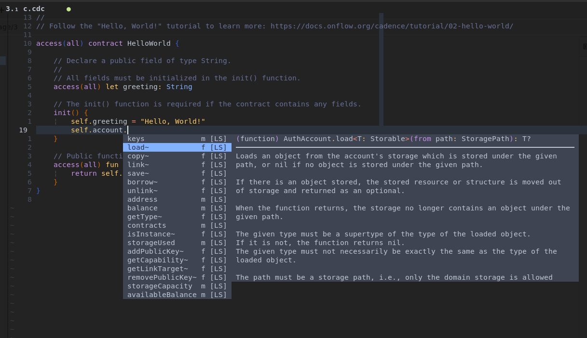
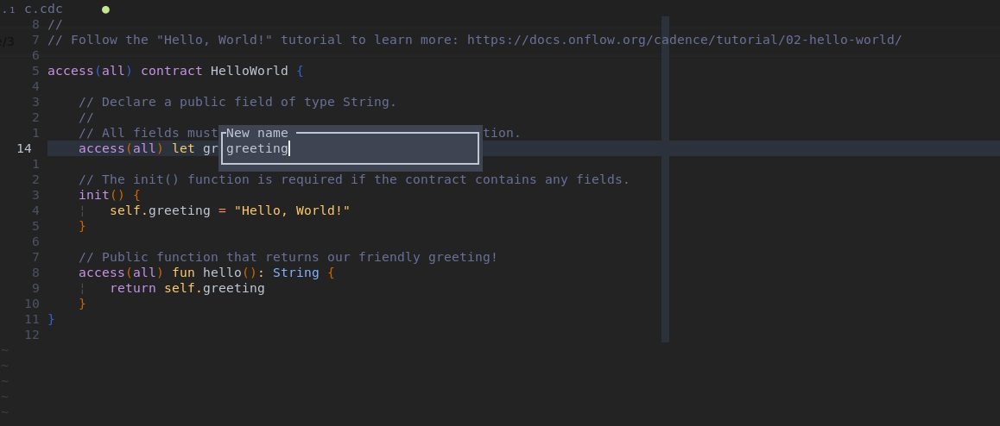

# coc-cadence
cadence language server extension for coc.nvim with Vim 8 / Neovim.

The plugin code is extracted from [vscode-cadence](https://github.com/onflow/vscode-cadence)

## Install
In your vim/neovim, run the following command:

`:CocInstall coc-cadence`

## Features
We would like to support all features supported by the VSCode extension.
It is still under development.

- [x] Cadence Language Server
   - Code completion, including documentation
   - Type information on hover
   - Go to declaration
   - Go to symbol
   - Document outline
   - Renaming
   - Signature help
- [ ] Interact with Emulator
- [ ] Deploy Contract

## License

MIT

---

> This extension is built with [create-coc-extension](https://github.com/fannheyward/create-coc-extension)
