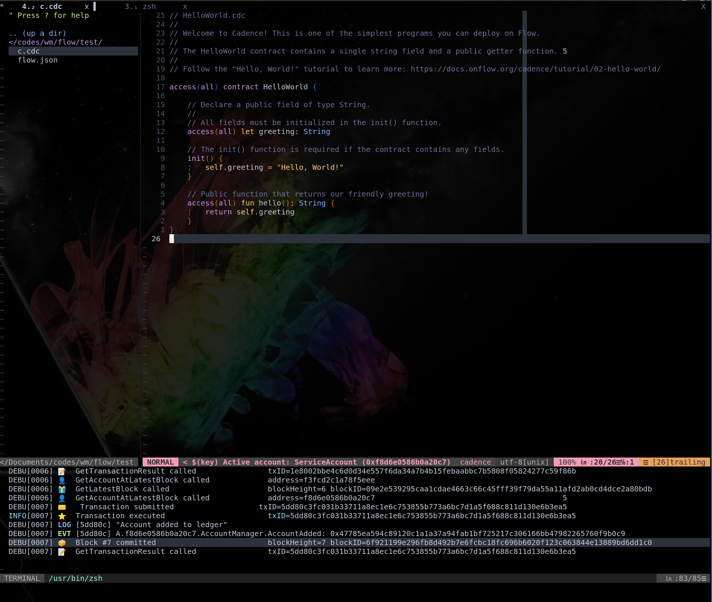
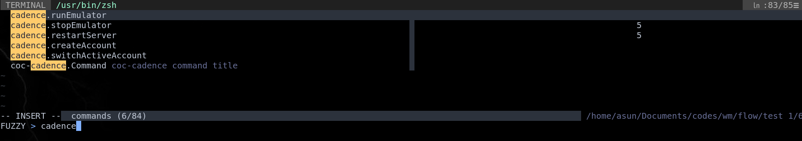
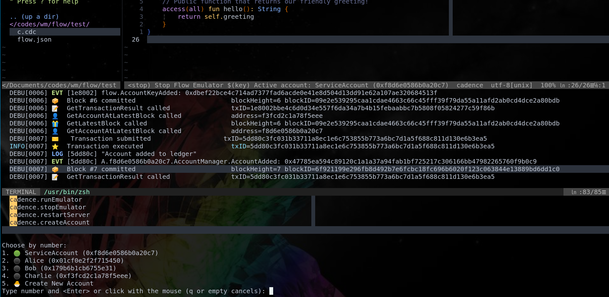
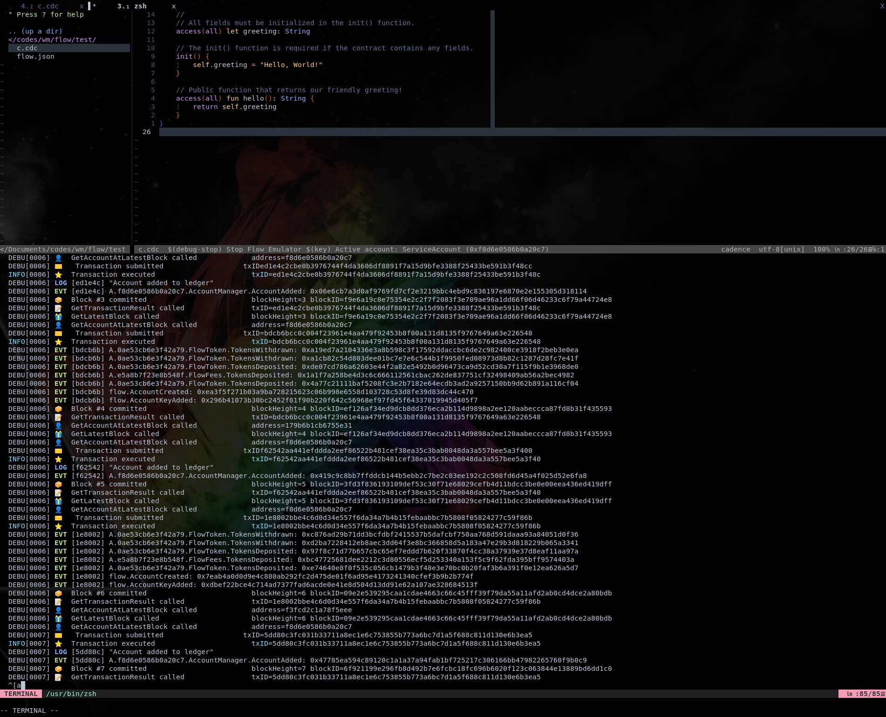

# coc-cadence
cadence language server extension for coc.nvim in **Vim** & **Neovim**.

The plugin code is extracted from [vscode-cadence](https://github.com/onflow/vscode-cadence)

For highlight of cadence filetype, you may need [vim-cadence](https://github.com/Cian911/vim-cadence)

## Install
In your vim/neovim, run the following command:

`:CocInstall coc-cadence`

or 

`Plug 'lucklyric/coc-cadence', {'do': 'yarn install --frozen-lockfile'}`

## Features
We would like to support all features supported by the VSCode extension.
It is still under development.

#### Autocomplete

#### Rename

#### Start Emulator in a builtin Terminal

#### Custom cadence command

#### Create and select account

## Features
- [x] Cadence Language Server
   - Code completion, including documentation
   - Type information on hover
   - Go to declaration
   - Go to symbol
   - Document outline
   - Renaming
   - Signature help
- [x] Interact with Emulator
- [ ] Deploy contract from editor

## License

MIT

---

> This extension is built with [create-coc-extension](https://github.com/fannheyward/create-coc-extension)
